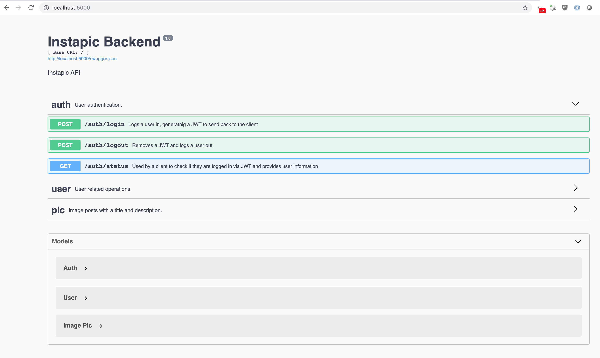

# InstaPic Backend

You can make cURL request to the app in action [here](https://limitless-spire-73807.herokuapp.com/).

Documentation is autogenerated by Swagger, but because it routes to HTTP it throws an error on Heroku. (Still looking into this). You can view all of the endpoints [here](https://limitless-spire-73807.herokuapp.com/swagger.json).

## Technologies
* Flask
* Swagger
* SQLAlchemy
* JWT

## Installation

You'll need `Python3` and `pip`.

You may want to create a [virtual environment](http://flask.pocoo.org/docs/1.0/installation/) first.

First install the dependancies. 
```
    $ pip install -r requirements.txt
```

To up the SQLLite3 DB:

You probably won't need to do this because it's versioned by heroku.

```
    $ python manage.py db init
    $ python manage.py db migrate -m "initial"
    $ python manage.py db upgrade
```

## Running

To run the app:

```
    $ python manage.py run 
```

The swagger documentation will be shown here for the API.

To run tests:

```
    $ python manage.py test
```



## Development Notes

Coming from an Epress/NodeSJ backends for web development, this was my first project using Flask for Python. Conceptually it's pretty similar. For this project I followed Flask's [tutorial](http://flask.pocoo.org/docs/1.0/tutorial/) and [this guide](https://www.freecodecamp.org/news/structuring-a-flask-restplus-web-service-for-production-builds-c2ec676de563/) initially to learn how a typical RESTful app is set up with Flask. Some of the things it's nice how easy they come out of the box in comparison with Express. I've primarily done direct SQL, so using an ORM with SQLAlchemy was a nice learning experience, even if the data model is pretty basic. Outside of general purpose scripting in Python I've never worked with any of these frameworks before so it was fun learning all the different pieces. 

## TODO

- Unit testing is quite minimal. I was a bit too constrained for time to work on the testing. 
- In terms of design, it's saving the image data directly to the DB which is far from ideal. I'd wire that up to S3 and just store the upload URL in the image table. 
- More server side validation, especially around the image uploading.
